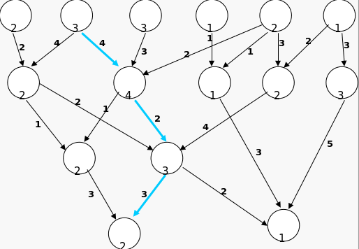
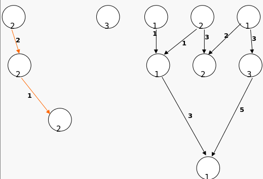
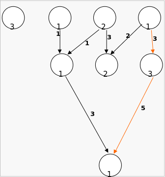
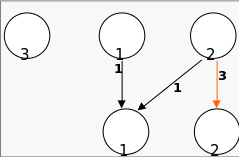
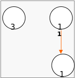
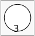

# OS-lab4-scheduler

### Critical Paths

A longest path between two given vertices s and t in a weighted graph G is the same thing as a shortest path in a graph −G derived from G by changing every weight to its negation. Therefore, if shortest paths can be found in −G, then longest paths can also be found in G.

For most graphs, this transformation is not useful because it creates cycles of negative length in −G. But if G is a directed acyclic graph, then no negative cycles can be created, and a longest path in G can be found.

The critical path method for scheduling a set of activities involves the construction of a directed acyclic graph in which the vertices represent project milestones and the edges represent activities that must be performed after one milestone and before another; each edge is weighted by an estimate of the amount of time the corresponding activity will take to complete. In such a graph, the longest path from the first milestone to the last one is the critical path, which describes the total time for completing the project.

Longest paths of directed acyclic graphs may also be applied in layered graph drawing: assigning each vertex v of a directed acyclic graph G to the layer whose number is the length of the longest path ending at v results in a layer assignment for G with the minimum possible number of layers. 

### Algorithm

On each step of algorithm we find critical path in our graph, then we delete all vertices on this path, and nullify edges between them. We continue this until all vertices are deleted:

### Time complexity
Time complexity is O(MNK), where M is number of edges, N is number of vertices and K is number of steps of our algorithm, wchich can vary between 1 and N. Complexity is O(MNK) because on each step of algorithm we use algorithm of Ford-Bellman, which have complexity O(MN). 